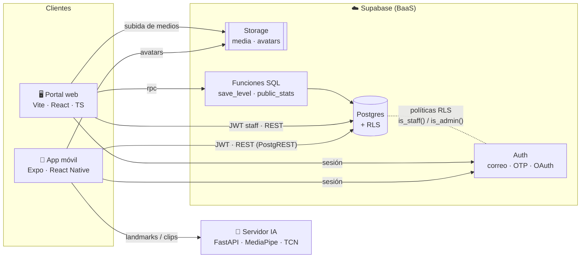
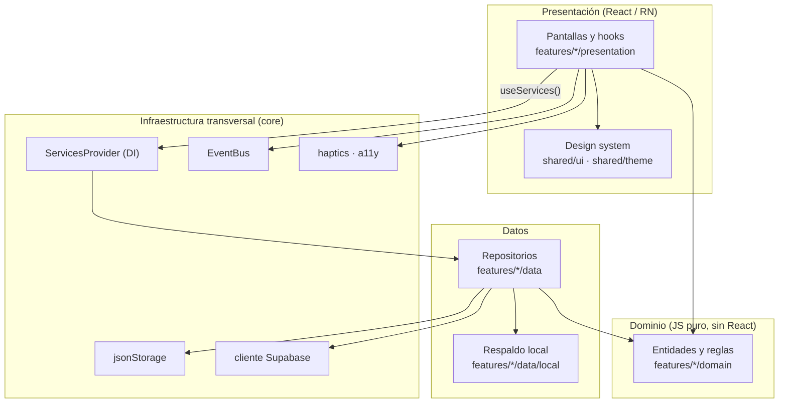
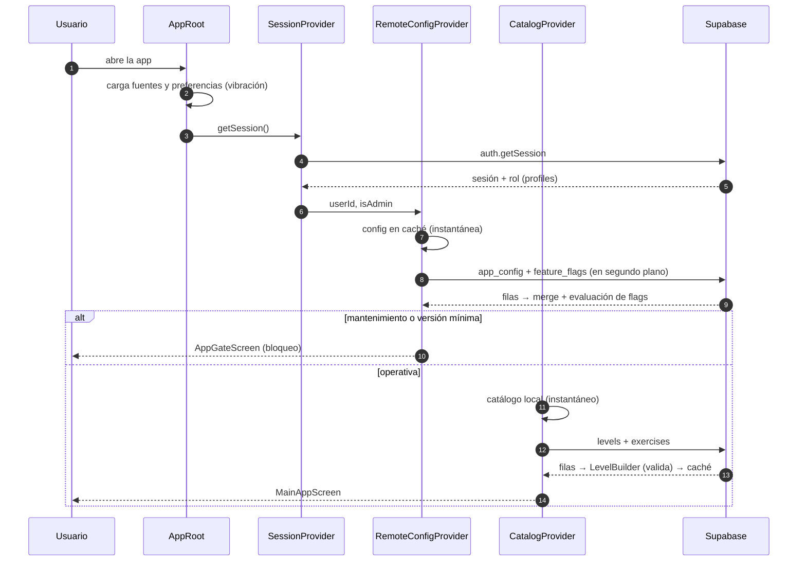
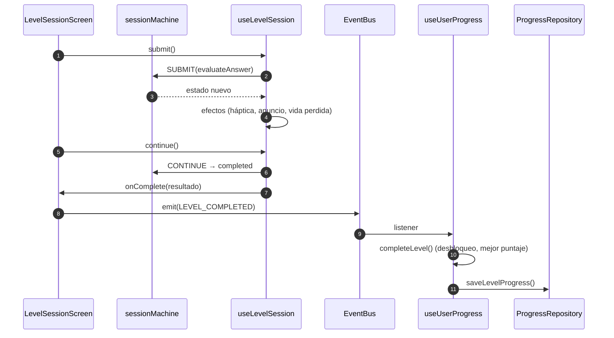
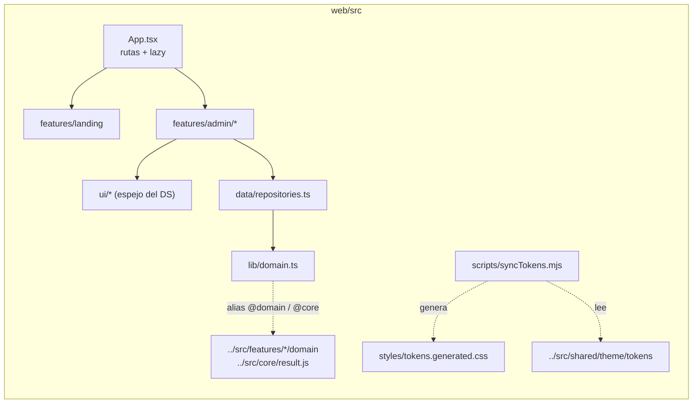

# 1. Arquitectura del sistema

## 1.1 Visión general

La plataforma sigue una arquitectura **cliente–BaaS**. La app móvil y el portal web se conectan directamente a Supabase, que concentra autenticación, base de datos, archivos y autorización. La autorización se resuelve con **Row Level Security (RLS)**, así que no hace falta un servidor de API propio para el CRUD. El reconocimiento de señas es el único servicio a medida: un servidor de IA en Python que usan solo las pantallas de cámara.



**Decisiones clave**

| Decisión | Motivo |
|---|---|
| Supabase como backend (sin API propia) | El contenido es CRUD con reglas de autorización simples. RLS lo protege en la base de datos misma, así que es imposible saltarse la regla desde un cliente manipulado. |
| La app funciona sin conexión | Cada repositorio intenta primero el servidor, después la caché local y al final los datos empaquetados. La app nunca se queda sin niveles ni diccionario. |
| Configuración remota en tablas (`app_config`, `feature_flags`) | Permite ajustar la app sin publicar versiones y deja cada cambio auditado por trigger. |
| Dominio JS puro y compartido | El portal importa `src/features/*/domain` de la app, así web y móvil validan ejercicios con el mismo código. |

## 1.2 Capas de la app móvil (feature-first + Clean Architecture)

Cada módulo de negocio vive en `src/features/<módulo>/` y se divide en tres capas:



**Regla de dependencias.** Presentación depende de Dominio y de los contratos de Datos. Dominio no depende de nada: no importa React, React Native ni Supabase. Solo `core/di/ServicesProvider.js` conoce las implementaciones concretas.

### Módulos

| Módulo | Dominio | Datos | Presentación |
|---|---|---|---|
| `auth` | `validation.js` | `SupabaseAuthRepository` | Login, Registro, Verificación OTP, Nueva contraseña, `SessionProvider` |
| `levels` | `ExerciseFactory`, `LevelBuilder`, `evaluateAnswer`, `sessionMachine`, `scoring`, `levelProgress` | `CatalogRepository` (remoto → caché → local) | Ruta de niveles, sesión de nivel, ejercicios, pistas, celebración |
| `progress` | `streak`, `livesPolicy` | `ProgressRepository` (AsyncStorage) | Progreso, `useUserProgress` |
| `signs` | `signDescription` | `SignsRepository` | `SignImage` |
| `dictionary` | — | usa `signs` | Diccionario con búsqueda |
| `games` | — | — | Memoria, Quiz |
| `camera` | — | `practiceSigns` | Práctica, Deletreo, Traducción, Señas dinámicas |
| `profile` | — | `SupabaseProfileRepository` | Perfil, preferencias |
| `videos` | — | `MediaRepository` | Videos |
| `remoteConfig` | `remoteConfig.js` (merge, flags, gates) | `RemoteConfigRepository` | Provider, pantalla de bloqueo, avisos |

### Estructura de carpetas

```
App.js · index.js                 entrada de Expo → src/app/AppRoot
src/
  app/                            composición: AppRoot (providers), RootNavigator, MainAppScreen
  core/                           config/env · di · events · storage · supabase · feedback · a11y · result
  shared/
    theme/                        tokens (colores, degradés, escalas) · ThemeProvider · fuentes
    ui/                           átomos, moléculas, feedback (diálogos, toast, overlay), carga y movimiento
  features/<módulo>/{domain,data,presentation}
web/                              portal (landing + panel) · reutiliza @domain y @core
supabase/                         SQL base + migrations/ + tests/ (RLS)
ai_module/                        servidor de IA (Python)
docs/                             esta documentación
```

## 1.3 Flujo de datos

### Arranque de la app



### Completar un nivel (Observer)



## 1.4 Portal web



Las rutas del panel son `/admin` (resumen), `/admin/levels`, `/admin/levels/:id`, `/admin/dictionary`, `/admin/vocabulary` y `/admin/media`. Las rutas `/admin/config`, `/admin/flags`, `/admin/audit` y `/admin/users` son solo para administradores. El panel se carga bajo demanda: la landing no descarga ese código.
