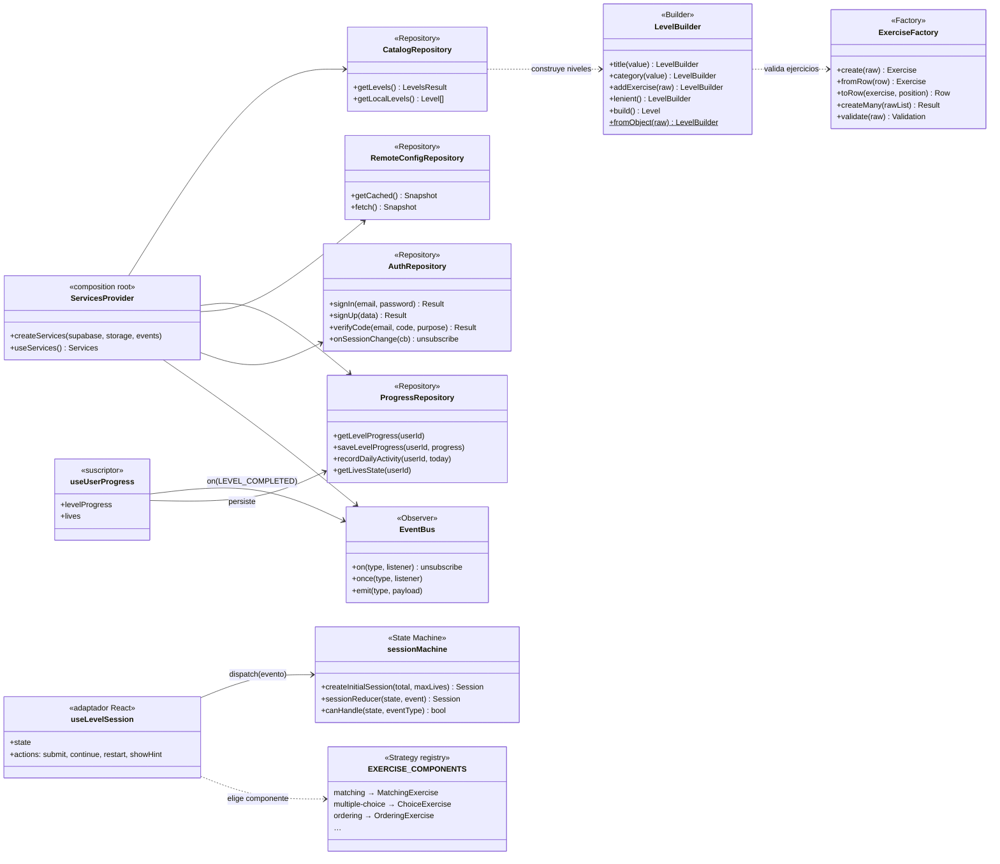
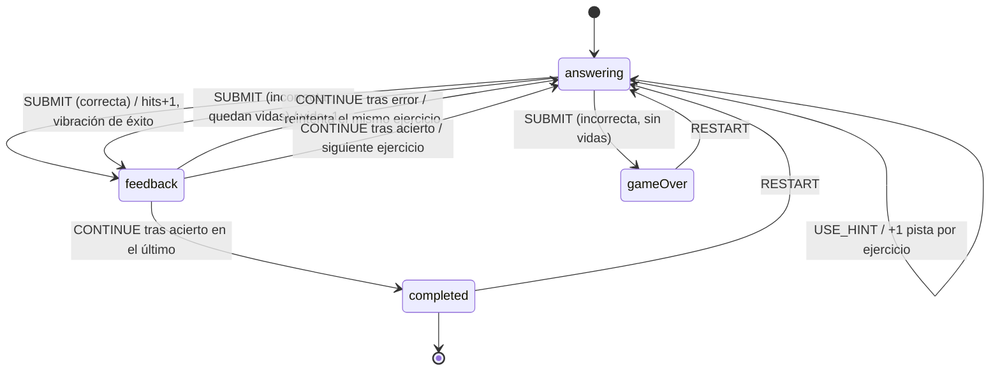
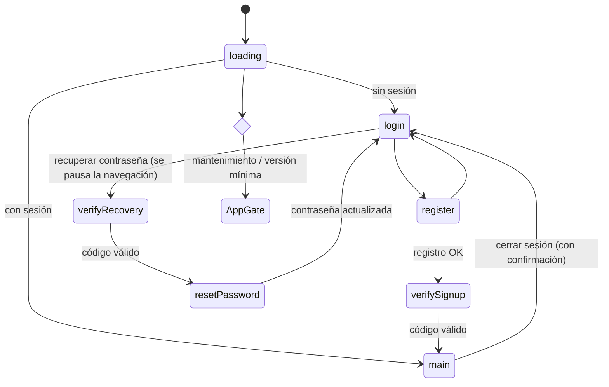
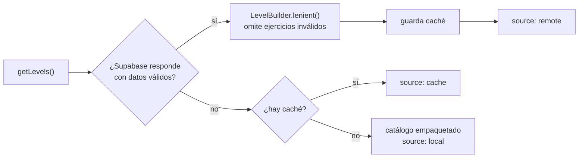

# 2. Patrones de diseño

| Patrón | Dónde | Problema que resuelve |
|---|---|---|
| **Repository** | `features/*/data/*Repository.js`, `web/src/data/repositories.ts` | Aísla a la UI de Supabase y AsyncStorage. Unifica la estrategia remoto → caché → local y la traducción de errores. |
| **Factory** | `levels/domain/ExerciseFactory.js` | Crea ejercicios válidos, normalizados e inmutables desde tres orígenes (catálogo local, fila de BD y formulario del panel). |
| **Builder** | `levels/domain/LevelBuilder.js` | Arma niveles paso a paso con validación al final. Tiene modo estricto (panel) y tolerante (app). |
| **State Machine** | `levels/domain/sessionMachine.js`, `app/RootNavigator.js` | Define las reglas del juego (responder, feedback, completado, sin vidas) y el flujo de autenticación como transiciones explícitas y testeables. |
| **Observer** | `core/events/EventBus.js`, `SessionProvider`, `RemoteConfigProvider` | Desacopla módulos: la sesión de nivel emite `LEVEL_COMPLETED` y el progreso lo persiste sin que se conozcan. |
| **Strategy / Registry** | `levels/presentation/exercises/index.js` | Asocia cada tipo de ejercicio a su componente. Un tipo nuevo no toca la pantalla del nivel. |
| **Inyección de dependencias** | `core/di/ServicesProvider.js`, `web/src/data/RepositoriesProvider.tsx` | Tiene un único *composition root*. Los tests inyectan repositorios falsos. |
| **Facade** | `core/feedback/haptics.js`, `shared/ui/feedback/FeedbackProvider.js` | Ofrece un vocabulario de intención (`haptics.success()`, `confirm()`, `runBlocking()`) sobre APIs de bajo nivel. |

## 2.1 Diagrama de clases de los patrones

## 2.2 Máquina de estados de la sesión de nivel

Los eventos que no figuran en la tabla `TRANSITIONS` se ignoran, por ejemplo un doble toque en «Continuar» durante la animación. El reducer es una función pura con tests en `levels/domain/__tests__`.

## 2.3 Máquina de estados de la navegación raíz

## 2.4 Repository con respaldo en tres niveles

