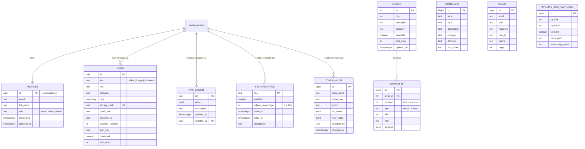

# 3. Modelo de dominio y datos

## 3.1 Diagrama de clases del dominio

```mermaid
classDiagram
  direction TB

  class Level {
    +int id
    +string title
    +string description
    +string category
    +bool available
    +int sortOrder
    +Exercise[] exercises
    +Warning[] warnings
  }

  class Exercise {
    <<abstract>>
    +string type
    +string title
    +string hint
  }
  class MatchingExercise { +string[] letters }
  class MultipleChoiceExercise { +string sign +string[] options +string correct }
  class OrderingExercise { +string[] letters }
  class TypingExercise { +string sign +string answer }
  class RecognitionExercise { +string[] signs +string[] options +string[] correct }
  class BuildWordExercise { +string word +string[] letters }
  class InterpretSignsExercise { +string word +string[] letters +string[] signs }
  class WordMeaningExercise { +string[] signs +string[] options +string correct }
  class TrueFalseExercise { +string statement +bool answer }

  Exercise <|-- MatchingExercise
  Exercise <|-- MultipleChoiceExercise
  Exercise <|-- OrderingExercise
  Exercise <|-- TypingExercise
  Exercise <|-- RecognitionExercise
  Exercise <|-- BuildWordExercise
  Exercise <|-- InterpretSignsExercise
  Exercise <|-- WordMeaningExercise
  Exercise <|-- TrueFalseExercise
  Level "1" *-- "1..*" Exercise

  class Session {
    +string status
    +int index
    +int total
    +int lives
    +int maxLives
    +int hits
    +int fails
    +int hintsUsed
    +Feedback feedback
    +string notice
  }
  class AnswerResult {
    +string status  incomplete|correct|incorrect
    +string message
  }
  class LevelResult {
    +int levelId
    +int score
    +int stars
    +int hits
    +int fails
    +int lives
  }
  Session ..> AnswerResult : consume
  Session ..> LevelResult : produce al completar
  Session --> Level : juega

  class LevelProgress {
    +int[] unlocked
    +Map~int, LevelResult~ completed
  }
  class Stats {
    +int streak
    +int bestStreak
    +string lastActiveDate
    +int totalDays
  }
  class LivesState {
    +int lives
    +number updatedAt
    +number nextRefillAt
  }
  class ScoringRules {
    +int hitPoints
    +int failPenalty
    +int lifeBonus
    +int hintPenalty
    +number[] starThresholds
  }
  class LivesConfig {
    +string mode  session|pool
    +int maxLives
    +int refillMinutes
  }
  class RemoteConfig {
    +Maintenance maintenance
    +Announcement[] announcements
    +LivesConfig lives
    +ScoringRules scoring
    +Difficulty difficulty
    +AppVersion appVersion
  }
  class FeatureFlags {
    +Map~string, bool~ flags
  }

  LevelProgress "1" o-- "*" LevelResult
  RemoteConfig *-- LivesConfig
  RemoteConfig *-- ScoringRules
  LevelResult ..> ScoringRules : se calcula con
  LivesState ..> LivesConfig : se recarga según

  class User {
    +uuid id
    +string email
    +Metadata user_metadata
  }
  class Profile {
    +uuid id
    +string role  user|editor|admin
  }
  User "1" -- "1" Profile

  class DictionaryEntry { +string letter +string sign +string description +string category +string difficulty }
  class VocabularySign { +string word +string type +string meaning +string howTo +string theme +int page }
  class MediaItem { +uuid id +string kind +string title +string category +string publicUrl +string captionsUrl +bool published }
```

## 3.2 Modelo entidad-relación (Supabase)

### Políticas de acceso (RLS)

| Tabla / bucket | Lectura | Escritura |
|---|---|---|
| `levels`, `exercises`, `dictionary`, `signs` | pública | staff (editor o admin) |
| `media` | publicados: pública · borradores: staff | staff |
| `app_config`, `feature_flags` | pública | admin |
| `config_audit` | admin | solo el trigger |
| `profiles` | el propio usuario y staff | el propio usuario (sin cambiar su rol) y admin |
| Storage `media` | pública | staff |
| Storage `avatars` | pública | cada usuario, solo en su carpeta `<uid>/` |
| `dynamic_sign_captures` | service role | service role |

## 3.3 Datos locales de la app (AsyncStorage)

Las claves antiguas `oratiolingo.*` (nombre interno anterior de la app) se migran automáticamente a `senaplay.*` al iniciar (`core/storage/migrateLegacyStorage.js`).

| Clave | Contenido |
|---|---|
| `senaplay.level.progress.v1.<uid>` | `LevelProgress` |
| `senaplay.stats.v1.<uid>` | `Stats` (racha) |
| `senaplay.lives.v1.<uid>` | `LivesState` (modo pool) |
| `senaplay.catalog.v2` | último catálogo remoto válido |
| `senaplay.dictionary.v1`, `senaplay.vocabulary.v1`, `senaplay.media.v1` | cachés de contenido |
| `senaplay.remoteConfig.v1` | última configuración remota |
| `senaplay.preferences.v1` | preferencias (vibración) |
| `senaplay.theme.mode.v1` | tema claro u oscuro |
| `senaplay.announcements.dismissed.v1` | avisos descartados |
