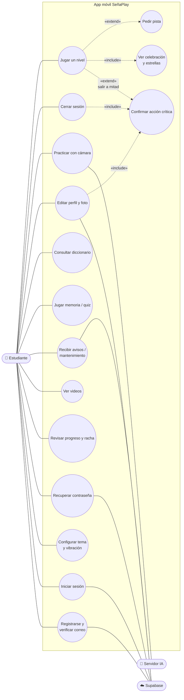
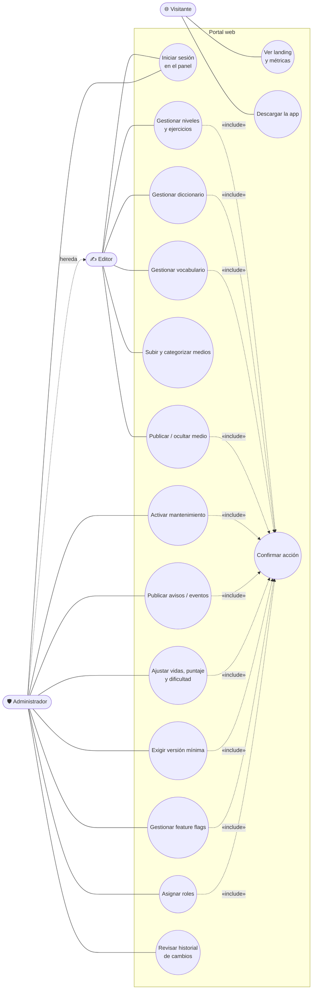

# 4. Casos de uso

Mermaid no tiene un tipo nativo de diagrama de casos de uso. Se representan con `flowchart`: actores a la izquierda y casos de uso como óvalos dentro del límite del sistema. Las relaciones `«include»` y `«extend»` van en las aristas.

## 4.1 Estudiante (app móvil)

### Especificación: «Jugar un nivel»

| Campo | Detalle |
|---|---|
| Actor | Estudiante |
| Precondición | Sesión iniciada, nivel desbloqueado y visible. En modo pool, al menos una vida. |
| Flujo principal | 1. Elige el nivel en la ruta. 2. Responde el ejercicio y toca «Verificar». 3. Recibe feedback visual, háptico y por lector de pantalla. 4. «Continuar». 5. Repite hasta el último ejercicio. 6. Ve la celebración (confeti, estrellas, resumen) y su progreso queda guardado. |
| Flujo alternativo A | Respuesta incompleta: aparece un aviso informativo y **no se pierde vida**. |
| Flujo alternativo B | Respuesta incorrecta: se pierde una vida con una animación sutil y se reintenta el mismo ejercicio. |
| Flujo alternativo C | Sin vidas: mensaje no punitivo con opción de reintentar o salir. |
| Flujo alternativo D | Salir a mitad: confirmación «¿Salir del nivel?». |
| Extensión | Pista: ampolleta flotante o mantener presionada una seña. Suma una penalización leve por ejercicio. |
| Postcondición | `LEVEL_COMPLETED` → progreso persistido y siguiente nivel desbloqueado. |

## 4.2 Administrador y editor (portal web)

### Especificación: «Activar mantenimiento»

| Campo | Detalle |
|---|---|
| Actor | Administrador |
| Precondición | Sesión con rol `admin` (verificado en el front y por RLS). |
| Flujo | 1. Configuración remota → Modo mantenimiento. 2. Activa el interruptor y edita título y mensaje. 3. «Publicar». 4. El diálogo advierte que esto bloqueará la app para todos y muestra el JSON exacto. 5. Confirma. 6. Se guarda en `app_config` y el trigger registra la auditoría. |
| Resultado en la app | Al abrir la app o al volver a primer plano (como máximo cada 5 min), `evaluateRemoteState` devuelve `gate: 'maintenance'` y se muestra `AppGateScreen` con «Reintentar». Los administradores no quedan bloqueados. |
