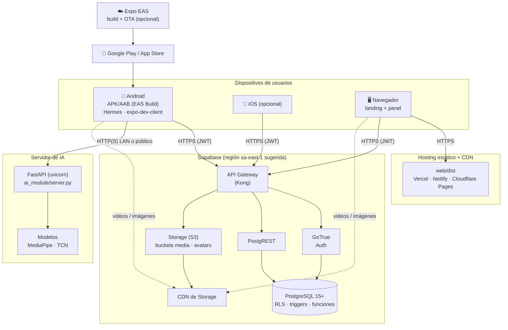
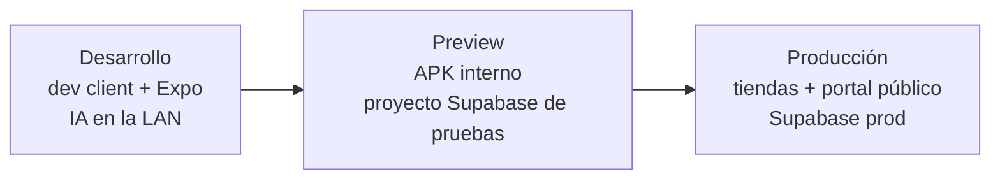

# 5. Despliegue

## 5.1 Topología

## 5.2 Componentes y configuración

| Nodo | Artefacto | Configuración |
|---|---|---|
| App móvil | build de EAS (`pnpm build:preview` o producción) | `EXPO_PUBLIC_SUPABASE_URL`, `EXPO_PUBLIC_SUPABASE_ANON_KEY`, `EXPO_PUBLIC_AI_SERVER_URL` (en `eas.json` o secretos de EAS) |
| Portal web | `web/dist` (`pnpm --dir web build`) | `VITE_SUPABASE_URL`, `VITE_SUPABASE_ANON_KEY`, `VITE_ANDROID_URL`, `VITE_IOS_URL`. Es una SPA: todas las rutas deben reescribirse a `index.html`. |
| Supabase | SQL de `supabase/` | Ejecutar en orden: `catalog.sql`, `dictionary.sql`, `signs.sql` (solo la primera vez) → `migrations/*.sql` |
| Servidor IA | `ai_module/` | `uvicorn server:app --host 0.0.0.0 --port 8000`. En producción va detrás de HTTPS. |

## 5.3 Puesta en producción (checklist)

1. **Base de datos:** ejecutar las migraciones en orden y verificar localmente con `pnpm test:sql`.
2. **Primer administrador:** `update public.profiles set role = 'admin' where email = '…';` en el SQL Editor.
3. **Auth:** agregar `oratiolingo://auth/callback` y el dominio del portal a las URL de redirección permitidas.
4. **Portal:** desplegar `web/dist` con reescritura SPA. En Netlify: `/* /index.html 200`. En Vercel: `rewrites` a `/`.
5. **App:** `pnpm verify:bundle`, después `eas build --profile production`.
6. **IA:** publicar el servidor con HTTPS y actualizar `EXPO_PUBLIC_AI_SERVER_URL`.
7. **Configuración remota:** revisar `appVersion.minimum` antes de publicar una versión incompatible.

> ⚠️ Una vez que el contenido se edite desde el panel, **no vuelvas a ejecutar** `catalog.sql`, `dictionary.sql` ni `signs.sql`: truncan las tablas.

## 5.4 Entornos

Cada entorno usa sus propias variables `EXPO_PUBLIC_*` y `VITE_*`. El código no cambia entre entornos.
