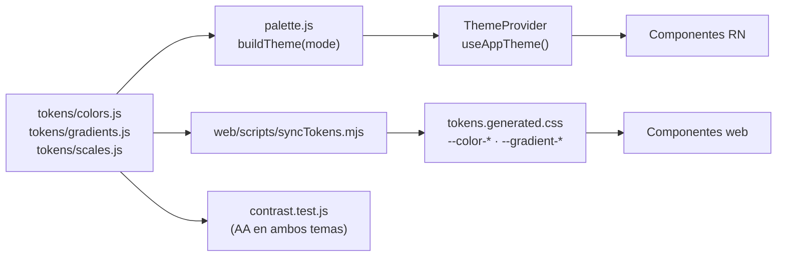

# 7. Sistema de diseño

**Fuente única:** `src/shared/theme/tokens/`. La app los consume con `useAppTheme()`. El portal web los recibe como variables CSS, que genera `web/scripts/syncTokens.mjs` antes de cada `dev` o `build`.

## 7.1 Tokens de color

Cada token existe en modo **claro** (violeta‑magenta) y **oscuro** (dorado‑ámbar). `contrast.test.js` verifica que ambos temas definan exactamente los mismos tokens y que los pares de texto cumplan **WCAG 2.1 AA (≥ 4.5:1)**.

| Grupo | Tokens | Uso |
|---|---|---|
| Superficies | `background`, `backgroundSoft`, `surface`, `surfaceRaised`, `surfaceSunken`, `border`, `borderStrong` | fondos, tarjetas, diálogos, campos |
| Texto | `textPrimary`, `textSecondary`, `textMuted`, `textInverse`, `onHeader` | jerarquía tipográfica |
| Marca | `primary`, `primaryAlt` (decorativo), `primaryStrong`, `primarySoft`, `primaryContrast` | acciones y selección |
| Estado (relleno) | `success`, `danger`, `warning`, `info` + `*Soft` | bordes, fondos, iconos grandes |
| Estado (texto) | `successText`, `dangerText`, `warningText`, `infoText`, `goldText` | texto de estado sobre superficie |
| Sobre relleno | `onSuccess`, `onDanger`, `onWarning`, `onInfo` | texto encima del color de estado |
| Recompensa | `gold`, `goldDeep` | estrellas, racha |
| Sistema | `navInactive`, `focusRing`, `overlay`, `scrim`, `shadow`, `skeletonBase`, `skeletonHighlight` | navegación, foco, capas |
| Cámara | `cameraColors`, `cameraAlpha()` | escenario oscuro fijo sobre el video en vivo |

**Ajustes de accesibilidad respecto de la paleta original (modo claro):**

| Token | Antes | Ahora | Contraste |
|---|---|---|---|
| `danger` | `#D9435B` (4.09:1) | `#B8304A` | 5.63:1 |
| `navInactive` | `#9B87AC` (3.11:1) | `#7A6690` | 4.85:1 |
| Fin del degradé `brand` con texto blanco | `#D333FF` (3.69:1) | `#B429D9` | 4.93:1 |
| Texto de éxito | `#58CC02` (1.99:1) | `successText #2F7D0B` | 4.94:1 |

`#58CC02` sigue siendo el relleno de éxito, con texto `onSuccess` oscuro encima.

## 7.2 Degradés

| Intención | Claro | Oscuro | Uso |
|---|---|---|---|
| `brand` | `#8F1EAE → #B429D9` | `#FFBC10 → #FFCF55` | botón primario, chip y pestaña activos |
| `brandVivid` | `#8F1EAE → #D333FF` | `#E2A10A → #FFCF55` | barras de progreso y halos (sin texto chico) |
| `header` | `#6E1789 → #8F1EAE → #B429D9` | `#2A2240 → #3A2E5C → #4B3B73` | cabeceras, hero, auth, banner de celebración |
| `card` | `#FFFFFF → #F7EEFC` | `#221C35 → #1B1730` | tarjetas destacadas |
| `reward` | `#F2C94C → #FFE08A` | `#D9AE2C → #FFCF55` | logros, tiempo del quiz |
| `success` / `danger` | verdes / rojos de estado | versiones claras | feedback |
| `celebration` | violeta → magenta → dorado | lila → ámbar | confeti y acento de diálogos de logro |

## 7.3 Escalas

| Escala | Valores |
|---|---|
| Espacio | `xxs 2 · xs 4 · sm 8 · md 12 · lg 16 · xl 20 · xxl 24 · xxxl 32` |
| Radio | `sm 8 · md 12` (botones e inputs) `· lg 14` (tarjetas) `· xl 20` (diálogos) `· xxl 24` (hojas) `· pill 999` |
| Tipografía (Poppins) | `display` 28/900 · `title` 22/800 · `heading` 17/700 · `body` 15/400 · `bodyStrong` 15/600 · `subtitle` 14/500 · `caption` 13/500 · `label` 13/600 · `button` 15/700 · `stat` 22/900 |
| Movimiento | `instant 110 · fast 160 · base 220 · slow 320 · emphasis 480 · celebration 900` ms · curvas `enter`, `exit`, `standard`, `pop` |
| Táctil | `MIN_TOUCH = 44` px (se completa con `hitSlop`) |

## 7.4 Componentes (`src/shared/ui`)

| Categoría | Componentes |
|---|---|
| Átomos | `AppText` (variante + tono), `Button` (primary · secondary · ghost · danger · success; estados pressed, focus, disabled y loading), `IconButton` (label obligatorio), `Card` (surface · raised · gradient · brand · tone), `TextField` (focus, error con icono, disabled, contraseña con mostrar/ocultar), `Chip`, `Badge`, `SegmentedControl`, `ProgressBar` |
| Moléculas | `SectionHeader`, `ScreenHeader`, `StatCard`, `EmptyState` |
| Carga | `Spinner` (anillo de marca + mano que «respira»), `Skeleton`, `SkeletonCard`, `SkeletonList`, `BlockingOverlay` |
| Feedback | `Dialog` (base), `ConfirmDialog`, `MessageDialog` (con presets), `Toast`, `BottomSheet`, `FeedbackProvider` → `confirm()`, `runBlocking()`, `notify()`, `showMessage()` |
| Movimiento | `FadeInView`, `StaggerItem`, `animations` (`shake`, `pulse`, `popIn`, `fadeTo`, `breathe`) |

## 7.5 Accesibilidad

- **Feedback multimodal:** cada resultado combina color, icono, texto, vibración (`haptics`) y anuncio al lector de pantalla (`announce`). La app no depende del audio.
- **Reducir movimiento:** `useReducedMotion()` salta al estado final o usa un fade corto. En web, `prefers-reduced-motion`.
- **Roles y labels:** `accessibilityRole` y `accessibilityLabel` en español en los controles; `accessibilityState` para selección y deshabilitado; regiones vivas para avisos.
- **No solo color:** estados con icono (✓, ✕, candado, estrellas) y texto.
- **Web:** `:focus-visible` con `focusRing`, *skip link*, diálogos con `aria-modal`, foco inicial y cierre con Escape.
