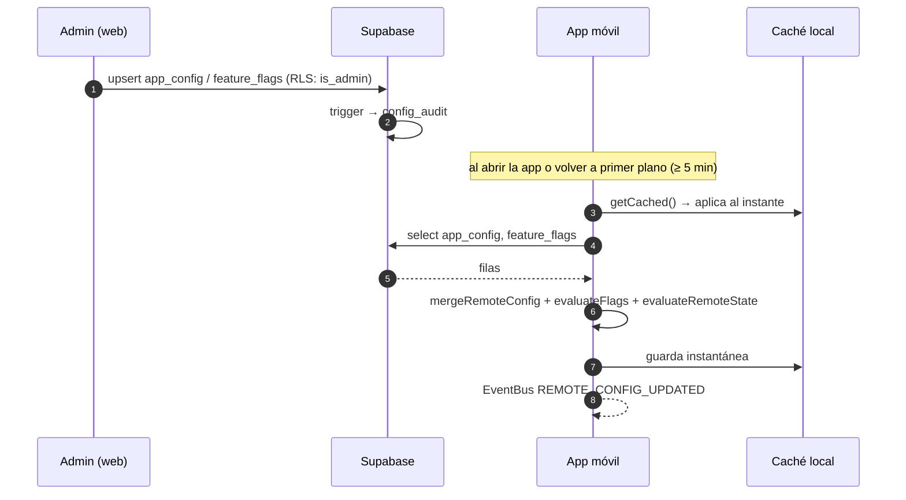

# 8. Configuración remota y feature flags

Permite **cambiar el comportamiento de la app sin recompilar**. Se edita desde el panel web (`/admin/config` y `/admin/flags`, solo administradores).

## 8.1 Cómo llega a la app

Si Supabase no responde se usa la última configuración guardada. Si no existe ninguna, se usan los **defaults**, que reproducen exactamente el comportamiento original.

## 8.2 Claves de `app_config`

| Clave | Estructura | Efecto en la app |
|---|---|---|
| `maintenance` | `{ enabled, title, message }` | `AppGateScreen` bloquea la app (excepto a administradores) |
| `announcements` | `[{ id, title, message, tone, startsAt, endsAt, dismissible }]` | `AnnouncementBanner` sobre el contenido, dentro de su ventana de fechas |
| `lives` | `{ mode: 'session' \| 'pool', maxLives, refillMinutes }` | `session`: cada nivel empieza con `maxLives`. `pool`: vidas globales con recarga; sin vidas no se puede iniciar un nivel. |
| `scoring` | `{ hitPoints, failPenalty, lifeBonus, hintPenalty, starThresholds }` | puntaje y estrellas al completar |
| `difficulty` | `{ quizSecondsPerQuestion, aiConfidenceThreshold, spellingConfidenceThreshold, hintsEnabled }` | tiempo del quiz, exigencia de la IA y ampolleta de pistas |
| `appVersion` | `{ minimum, recommended, storeUrl }` | menor que `minimum`: bloqueo «Actualiza SeñaPlay». Menor que `recommended`: aviso. |

## 8.3 Feature flags

| Flag | Controla |
|---|---|
| `games.memory`, `games.quiz`, `games.practice`, `games.spelling`, `games.cameraTranslation`, `games.dynamicMonitor` | juegos visibles en la pestaña Juegos |
| `videos.enabled` | pestaña Videos |
| `feedback.haptics` | vibración global (se combina con la preferencia del usuario) |
| `levels.celebration` | confeti al completar un nivel |
| `events.*` | eventos temporales: se crean desde el panel con fechas de inicio y fin |

**Evaluación** (`evaluateFlags`): `enabled` **y** dentro de la ventana `[starts_at, ends_at]` **y** `rolloutBucket(key, userId) < rollout_percentage`. El bucket es un hash FNV‑1a estable, así que el mismo usuario siempre cae en el mismo grupo.

## 8.4 Guía operativa

| Situación | Acción |
|---|---|
| Mantenimiento de la base de datos | Activar `maintenance` → ejecutar → desactivar. Los usuarios ven «Reintentar». |
| Evento temático (ej. Semana de la Inclusión) | Crear `events.inclusion` con fechas y un aviso en `announcements` con las mismas fechas. |
| Probar un juego nuevo con pocos usuarios | Flag con `rollout_percentage` en 10–20 % y subir de a poco. |
| Una versión vieja tiene un bug grave | Subir `appVersion.minimum` y poner `storeUrl`. |
| Revertir un cambio | `/admin/audit` muestra el valor anterior de cada cambio. |
